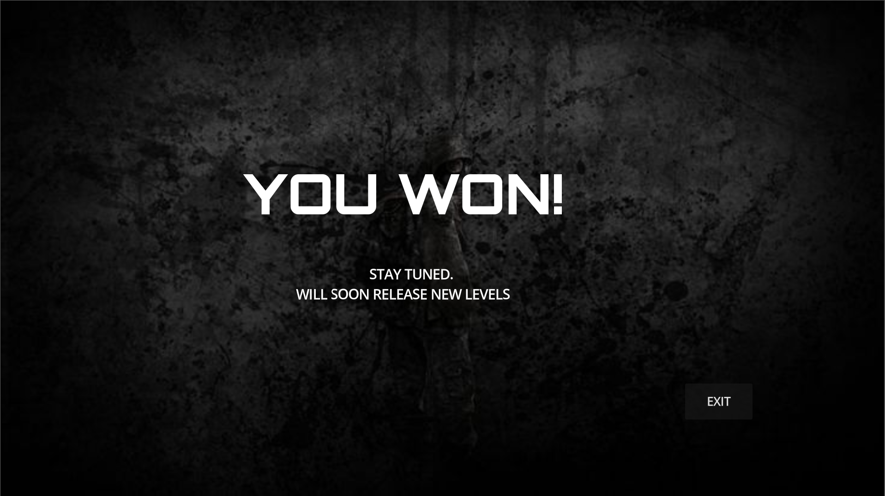

# INFECTD: Antidote Escape — Zombie Survival Game

> A GUI-based 2D zombie maze game made in **Godot 4** (inspired by AAA gameplay mechanics)  
> Developed by: **Khushi Kumari**  
> Course: Programming in C++ | Year: 2024–2025 | UWE Bristol  
> **Project Goal:** Go beyond console-based games and deliver a professional GUI-level experience using modern development techniques.

---

## 🎮 About the Game

**INFECTD** is a top-down 2D maze survival game set in a world overrun by zombies. Your mission?  
**Collect antidote elements, survive waves of zombies, and escape to the next level.**

Built using **Godot 4** with a beautiful GUI interface and custom HUDs, the game reflects intelligent game design, strong logic, and polished execution.  
It was created as a part of the *Programming in C++* module, with backend C++ structure mirrored in the repo to reflect programming proficiency.

---

##  Key Features

### Gameplay Mechanics
- Three challenging levels: **Level 1**, **Level 2**, **Level 3**
- Dynamic zombie types (walk1, walk2, walk3) with AI movement
- Wave-based spawning system (each level gets harder!)
- Collect **antidote elements** to form the cure
- Automatic level transitions after antidotes are collected

### Game UI & Systems
- **Main Menu** with Start, Instructions, and Quit
- **In-game HUD** with:
  - Real-time score 
  - Player position 
  - Zombies spawn rate 
  - Antidotes left 
- End Screen with Exit option
- Smooth **level popup** transitions
- **Keyboard Controls** shown with visual instructions

### Audio
- Background music in menus and levels
- Footstep, shooting, and pickup sounds
- Button sound FX on click

### File Organization & Structure
- Game logic in **GDScript**
- **Mirrored C++ header/source files** in `/src` folder to reflect C++ skills
- Assets organized into structured folders (Zombies, Antidotes, UI, Audio)
- Exports include a working `.exe` and `.pck` for easy play

---

##  How to Run the Game

### Option 1: **Play Instantly (Windows)**

> No installation or setup required.

1. Download the latest release from the repository:  
    [`INFECTD.exe`](https://github.com/khushi1All/INFECTD_game_2025/releases) and `INFECTD.pck`
2. Place both files in the same folder.
3. **Double-click `INFECTD.exe`** to start playing.

---

### Option 2: **Run from Source (Godot 4.x)**

> Ideal if you want to explore the code or contribute.

#### 1. Clone the Repository

```bash
git clone https://github.com/khushi1All/INFECTD_game_2025.git
```
cd INFECTD_game_2025

#### 2. Open in Godot Engine

- Launch **Godot 4.x**
- Click **"Import"**, then select the `project.godot` file from the cloned folder  
  _or simply drag the entire folder into the Godot Project Manager_
- Set the startup scene to:  
  `Scenes/MainMenu.tscn`  
  via **Project > Project Settings > Application > Run > Main Scene**

#### 3. Run the Game

Press **F5** or click the  Play icon in the editor to launch the game.

---

##  How to Play

| Action         | Key          |
|----------------|--------------|
| Move           | W, A, S, D   |
| Shoot          | Space        |
| Collect Item   | Walk near it |
| Quit Game      | Quit Button  |

>  Collect all antidotes in each level to form the cure and unlock the next stage!

---
## Game short view

###  Main Menu


###  Level 1 Gameplay


###  Level 2 Gameplay


###  Level 3 Gameplay


### End Screen


---

##  License

This project is open-source and free to use for personal and educational purposes.  
Please credit the creator when sharing or building upon this work.
---

##  Credits

- **Game Developer:** Khushi Kumari  
- **University:** UWE Bristol  
- **Module:** Programming in C++ (2024–2025)  
- **Engine:** [Godot 4](https://godotengine.org/)  
- **Languages Used:** GDScript, C++  

Special thanks to the UWE teaching staff and the open-source game dev community for guidance and inspiration.

---

##  Contact

Have feedback, suggestions, or want to collaborate?

- GitHub: [@khushi1All](https://github.com/khushi1All)
- Email: *khushi.7all@gmail.com* 
- LinkedIn: *https://www.linkedin.com/in/khushi-kumari-a5585830b/*

---

** Don’t forget to star the repo if you enjoyed the game!**

